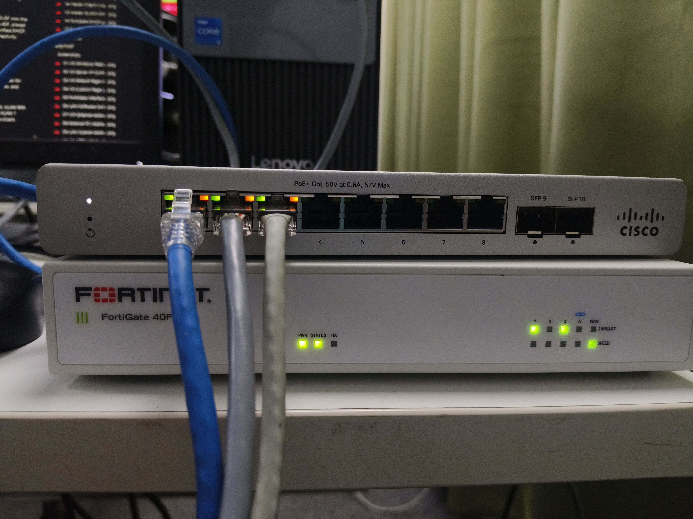
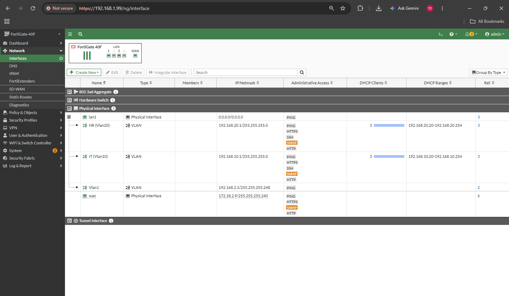
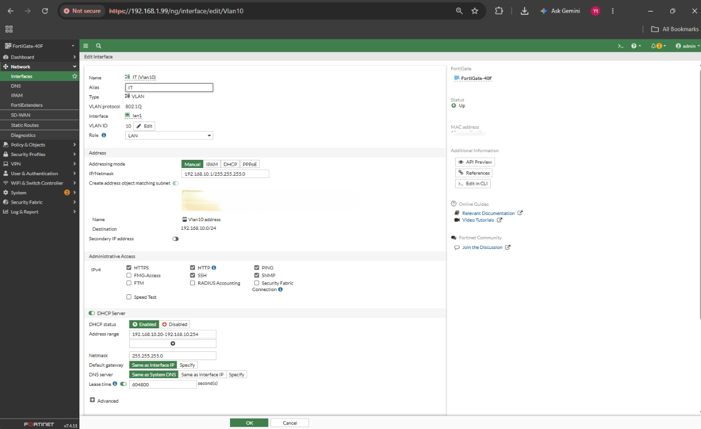
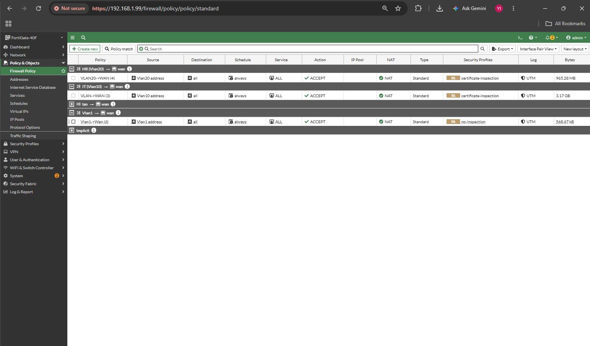
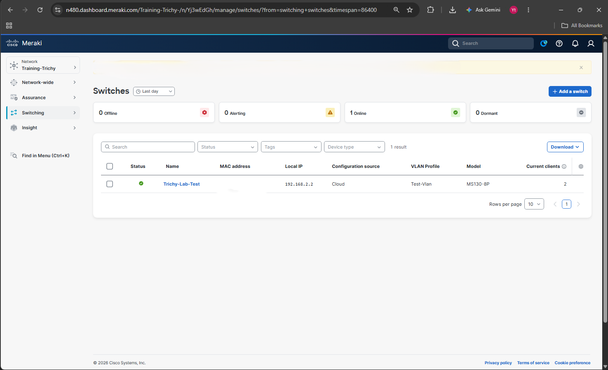
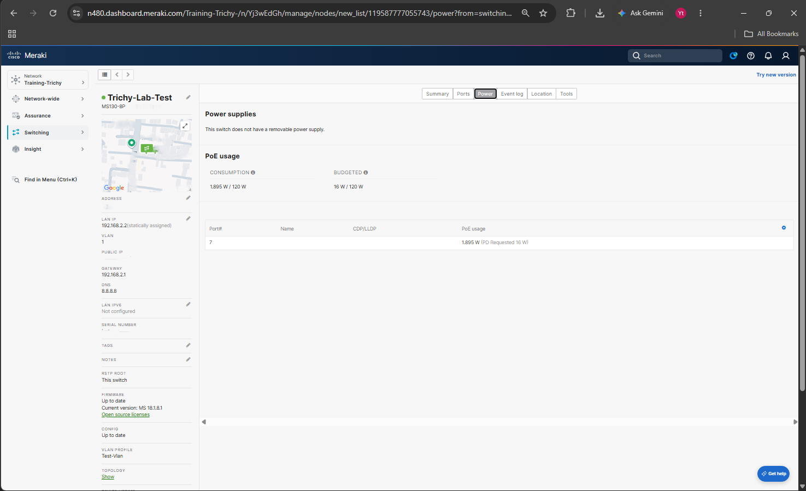
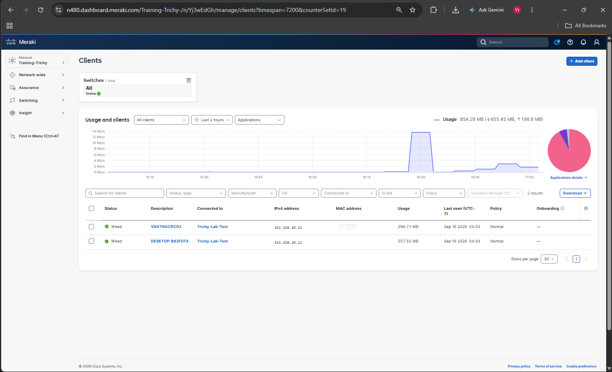

# Cisco Meraki MS130-8P + FortiGate 40F VLAN Segmentation Lab

A lab where a **cloud-managed Cisco Meraki MS130-8P** access switch is integrated with a **FortiGate 40F** acting as the inter-VLAN gateway and internet edge — with VLAN segmentation, per-VLAN DHCP, NAT policies and end-to-end client verification.

---

## 📌 Project Objective

Deploy a Meraki MS130-8P switch under Dashboard management, build a **Named VLAN profile** (IT / HR / Management / default), assign access and trunk ports, and use the FortiGate 40F as the **router-on-a-stick gateway** for every VLAN — then prove that clients in each VLAN get DHCP, reach their gateway, resolve DNS and browse the internet.

---

## 🖧 Network Topology

| Layer     | Device                            | Role                                                       |
| --------- | --------------------------------- | ---------------------------------------------------------- |
| Internet  | Upstream router / ISP             | Next hop `172.18.2.1`                                      |
| Edge      | FortiGate 40F (FortiOS v7.4.11)   | WAN `172.18.2.9/28`, NAT, inter-VLAN gateway, DHCP server   |
| Access    | Cisco Meraki MS130-8P             | Cloud-managed L2 switch, VLAN tagging, PoE                 |
| Endpoints | VNXTNOCPC03 (IT) / DESKTOP-B83F0T4 (HR) | Test clients on VLAN 10 and VLAN 20                  |

**VLAN / IP plan**

| VLAN | Name       | Subnet            | Gateway (FortiGate) | DHCP Range                      |
| ---- | ---------- | ----------------- | ------------------- | ------------------------------- |
| 1    | Management | `192.168.2.0/29`  | `192.168.2.1`       | Static — switch uses `192.168.2.2` |
| 10   | IT         | `192.168.10.0/24` | `192.168.10.1`      | `192.168.10.20 – 192.168.10.254` |
| 20   | HR         | `192.168.20.0/24` | `192.168.20.1`      | `192.168.20.20 – 192.168.20.254` |
| 999  | default    | —                 | —                   | Native VLAN on the uplink trunk |

**Traffic flow:** Client PC → MS130-8P access port (tagged VLAN 10/20) → trunk uplink → FortiGate `lan1` sub-interfaces → NAT policy → `wan` → Internet

---

## 🔌 Physical Setup

MS130-8P stacked on top of the FortiGate 40F — switch port 1 trunked to the FortiGate LAN, ports 2 and 3 carrying the two client PCs.

---

## ⚙️ Part A — FortiGate 40F Configuration

### 1. System Status Baseline

FortiGate 40F running **FortiOS v7.4.11 build 2878** in **NAT mode**, managed at `192.168.1.99`, FortiGate Cloud activated.

### 2. VLAN Sub-Interface Overview

Three 802.1Q VLAN sub-interfaces created on the physical `lan1` port, plus the `wan` interface facing the upstream router.

| Interface   | Type  | Parent | IP / Netmask                | Admin Access                     |
| ----------- | ----- | ------ | --------------------------- | -------------------------------- |
| `Vlan1`     | VLAN  | lan1   | `192.168.2.1/29`            | PING                             |
| `IT (Vlan10)`  | VLAN | lan1 | `192.168.10.1/24`           | PING, HTTPS, HTTP, SSH, SNMP     |
| `IT (Vlan20)`  | VLAN | lan1 | `192.168.20.1/24`           | PING, HTTPS, HTTP, SSH, SNMP     |
| `wan`       | Phys. | —      | `172.18.2.9/28`             | PING, HTTPS, HTTP, SNMP          |

### 3. VLAN 1 — Management Interface

VLAN ID 1 on `lan1`, addressed `192.168.2.1/255.255.255.248` (/29). **No DHCP server** — the Meraki switch takes a static management IP from this subnet. PING is the only administrative access enabled.

### 4. VLAN 10 — IT Segment + DHCP

VLAN ID 10, alias `IT`, addressed `192.168.10.1/255.255.255.0` with the DHCP server enabled.

| Setting        | Value                             |
| -------------- | --------------------------------- |
| Address range  | `192.168.10.20 – 192.168.10.254`  |
| Netmask        | `255.255.255.0`                   |
| Default gateway | Same as Interface IP             |
| DNS server     | Same as System DNS                |
| Lease time     | `604800` seconds (7 days)         |

### 5. VLAN 20 — HR Segment + DHCP

VLAN ID 20, alias `HR`, addressed `192.168.20.1/255.255.255.0`, DHCP range `192.168.20.20 – 192.168.20.254` with the same netmask, gateway and lease settings as VLAN 10.

### 6. Default Route

Static default route `0.0.0.0/0.0.0.0` pointing to gateway `172.18.2.1` out of the `wan` interface, administrative distance `10`, status **Enabled**.

### 7. Firewall Policies (VLAN → WAN)

One NAT-enabled **ACCEPT** policy per segment so each VLAN can egress to the internet independently.

| Policy         | Source          | Destination | Service | Action | NAT | Inspection             |
| -------------- | --------------- | ----------- | ------- | ------ | --- | ---------------------- |
| `VLAN20->WAN`  | Vlan20 address  | all         | ALL     | ACCEPT | ✅  | certificate-inspection |
| `VLAN->WAN`    | Vlan10 address  | all         | ALL     | ACCEPT | ✅  | certificate-inspection |
| `Vlan1->Wan`   | Vlan1 address   | all         | ALL     | ACCEPT | ✅  | no-inspection          |

---

## ☁️ Part B — Cisco Meraki MS130-8P Configuration

### 8. Switch Onboarding & Inventory

MS130-8P claimed into the **Training-Trichy** network, named `Trichy-Lab-Test`, reporting **Online** with configuration source **Cloud**, local IP `192.168.2.2`, VLAN profile `Test-Vlan`.

### 9. Named VLAN Profile

Created the `Test-Vlan` profile (marked **Default**, assigned to 1 switch) so VLANs can be referenced by name across the network.

| # | VLAN name  | VLAN ID |
| - | ---------- | ------- |
| 1 | default    | 999     |
| 2 | IT         | 10      |
| 3 | HR         | 20      |
| 4 | Management | 1       |

### 10. Switch Port VLAN Assignments

| Port | Name | Type   | VLAN        | Purpose                            |
| ---- | ---- | ------ | ----------- | ---------------------------------- |
| 1    | —    | trunk  | native 999  | **Uplink to FortiGate `lan1`** (carries VLAN 1/10/20 tagged) |
| 2    | IT   | access | 10          | IT client PC                       |
| 3    | HR   | access | 20          | HR client PC                       |
| 4–10 | —    | trunk  | native 1    | Unused / reserved                  |

### 11. PoE Usage

The MS130-8P provides a **120 W** PoE+ budget. A powered device on port 7 requested 16 W and is drawing 1.895 W — confirming PoE negotiation is working.

| Metric      | Value           |
| ----------- | --------------- |
| Consumption | `1.895 W / 120 W` |
| Budgeted    | `16 W / 120 W`  |

---

## 🔬 Part C — Verification & Testing

### 12. VLAN 10 (IT) Client Connectivity Test

From the IT PC on port 2:

- `ipconfig` → IPv4 `192.168.10.21`, mask `255.255.255.0`, gateway `192.168.10.1` ✅ DHCP working
- `ping 8.8.8.8` → 4/4 replies, avg **11 ms**, 0% loss ✅ NAT + default route working
- `nslookup google.com` → resolved via `8.8.8.8` ✅ DNS working
- `ping 192.168.10.1` → 4/4 replies, `<1 ms`, TTL 255 ✅ gateway reachable

### 13. VLAN 20 (HR) Client Connectivity Test

From the HR PC on port 3:

- `ipconfig` → IPv4 `192.168.20.22`, gateway `192.168.20.1` ✅
- `ping 8.8.8.8` → 4/4 replies, avg **7 ms**, 0% loss ✅
- `nslookup google.com` → resolved via `8.8.8.8` ✅
- `ping 192.168.20.1` → 4/4 replies, `<1 ms` ✅

### 14. Meraki Client Inventory

Dashboard confirms both wired clients learned on the correct ports with the correct addressing.

| Client           | Connected to    | IPv4 address    | VLAN | Port |
| ---------------- | --------------- | --------------- | ---- | ---- |
| VNXTNOCPC03      | Trichy-Lab-Test | `192.168.10.21` | 10   | 2    |
| DESKTOP-B83F0T4  | Trichy-Lab-Test | `192.168.20.22` | 20   | 3    |

### 15. Switch Health Summary

`Trichy-Lab-Test` **Online**, firmware **MS 18.1.8.1**, configuration up to date, statically assigned `192.168.2.2` on VLAN 1 with gateway `192.168.2.1` and DNS `8.8.8.8`, 2 clients connected.

### 16. FortiGate DHCP Lease Verification

DHCP Monitor shows active leases handed out on each interface, confirming the FortiGate is serving both VLANs through the Meraki trunk.

| Device          | IP              | Interface     | Status     |
| --------------- | --------------- | ------------- | ---------- |
| ThinkVision     | `192.168.1.110` | lan           | Leased out |
| VNXTNOCPC03     | `192.168.10.21` | IT (Vlan10)   | Leased out |
| DESKTOP-B83F0T4 | `192.168.20.22` | HR (Vlan20)   | Leased out |

### 17. Routing Table Verification

Routing Monitor shows 6 routes — 1 static default plus 5 connected networks, one per configured interface.

| Network            | Gateway IP   | Interface    | Distance | Type      |
| ------------------ | ------------ | ------------ | -------- | --------- |
| `0.0.0.0/0`        | `172.18.2.1` | wan          | 10       | Static    |
| `172.18.2.0/28`    | `0.0.0.0`    | wan          | 0        | Connected |
| `192.168.1.0/24`   | `0.0.0.0`    | lan          | 0        | Connected |
| `192.168.2.0/29`   | `0.0.0.0`    | Vlan1        | 0        | Connected |
| `192.168.10.0/24`  | `0.0.0.0`    | IT (Vlan10)  | 0        | Connected |
| `192.168.20.0/24`  | `0.0.0.0`    | HR (Vlan20)  | 0        | Connected |

---

## ✅ Results

- Successfully onboarded and cloud-managed a **Cisco Meraki MS130-8P** switch under the `Training-Trichy` Dashboard network.
- Built a **Named VLAN profile** (`Test-Vlan`) covering Management, IT, HR and default VLANs.
- Configured **access ports** for client VLANs and a **trunk uplink** to the FortiGate, with the switch itself managed in-band on VLAN 1.
- Deployed **router-on-a-stick** inter-VLAN routing on the FortiGate 40F using 802.1Q sub-interfaces on `lan1`.
- Verified **per-VLAN DHCP**, gateway reachability, DNS resolution and NAT internet access from clients in both VLAN 10 and VLAN 20.
- Confirmed **PoE+ delivery** and budget headroom on the MS130-8P.

---

## 🛠️ Skills Demonstrated

`Cisco Meraki Dashboard` `MS130-8P` `Cloud-Managed Switching` `Named VLAN Profiles` `Access & Trunk Ports` `802.1Q Tagging` `PoE+` `FortiGate 40F` `FortiOS 7.4` `Router-on-a-Stick` `Inter-VLAN Routing` `DHCP Scopes` `NAT & Firewall Policy` `Static Routing` `ping / nslookup / ipconfig` `Network Troubleshooting`
